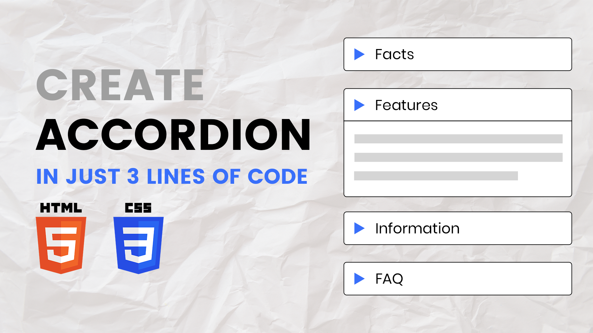

# Accordion / Collapsible Div with Just 3 Lines of Code (No Libraries Needed)

The "Accordion/Collapsible Div with Just 3 Lines of Code" tutorial teaches you how to create a simple and functional accordion or collapsible section using minimal HTML and CSS, without the need for any external libraries. This project focuses on leveraging basic CSS properties to achieve a clean and efficient collapsible effect.

By following this tutorial, you'll learn how to use CSS to toggle the visibility of content within a div, creating an interactive and space-saving design element for your web pages. This approach is perfect for developers seeking a quick and lightweight solution for adding collapsible sections to their websites.